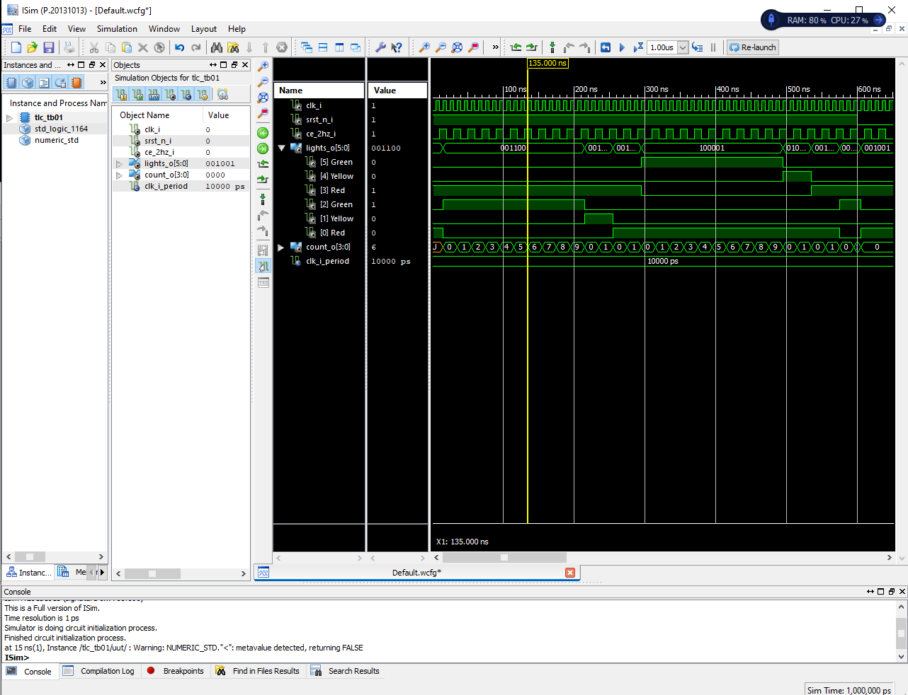
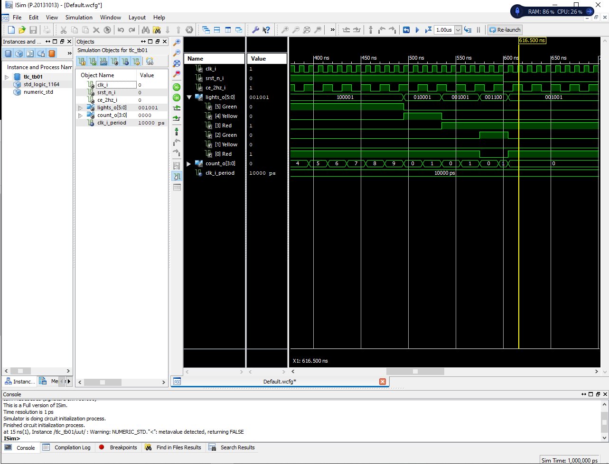

## Lab8 Simulations 

# Traffic lights


# Reset


## Top level


## State diagram

Je-li to nutné, tak by tam měly být šipky ukazující z daného stavu na tentýž stav, když s_count < c_1sec (příp. c_5sec)
## User defined data type
Examples: 
```javascript
TYPE state IS (idle, forward, backward, stop); 
TYPE color IS (red, green, blue, white, black); 
TYPE my_integer IS RANGE -32 TO 32; 
TYPE student_grade IS RANGE 0 TO 100; 
TYPE natural IS RANGE 0 TO +2147483647; 
TYPE bit IS ('0', '1'); 
TYPE my_logic IS ('0', '1', 'Z'); 

TYPE birthday IS RECORD 
  day: INTEGER RANGE 1 TO 31; 
  month: month_name; – month_name datatype should be predefined 
END RECORD; 
```
