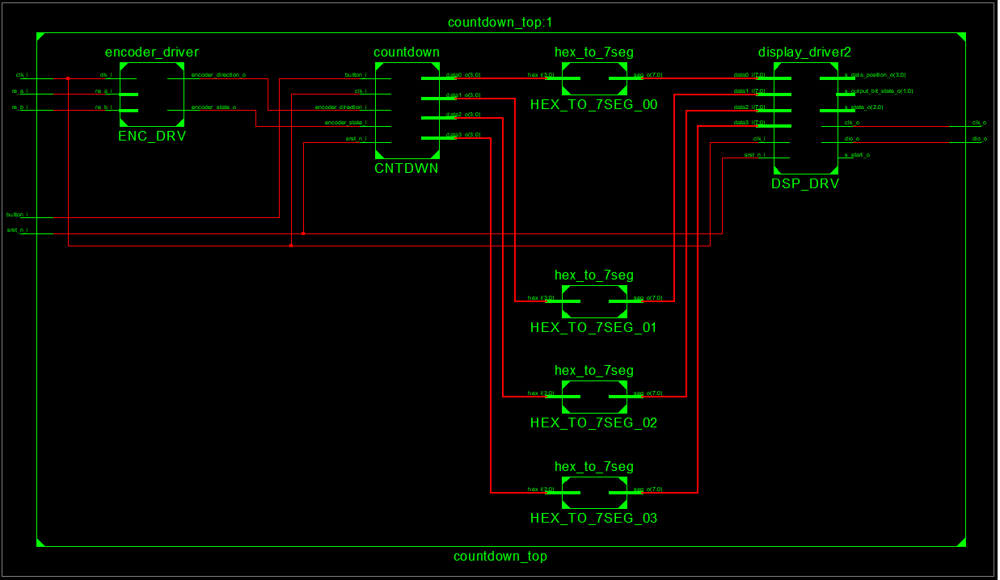
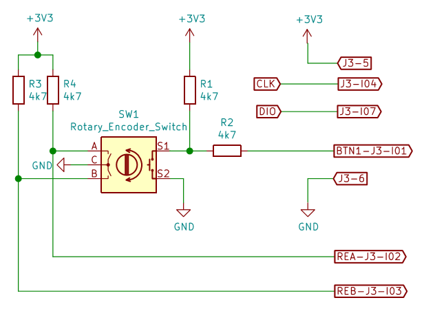
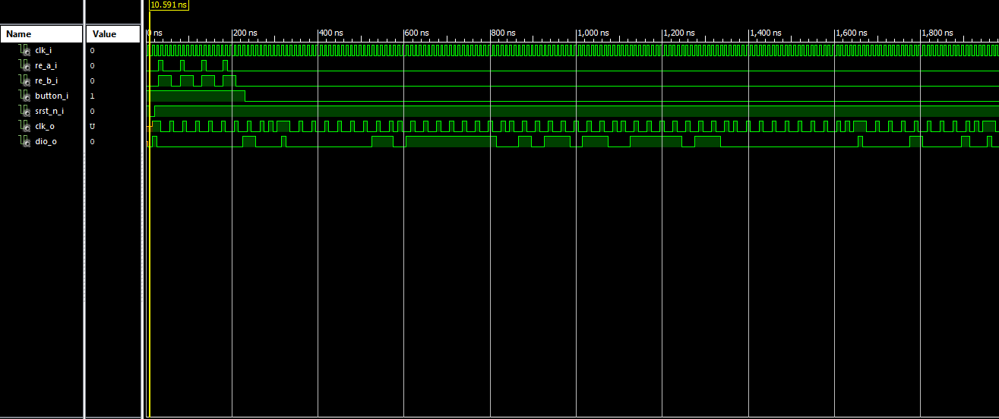
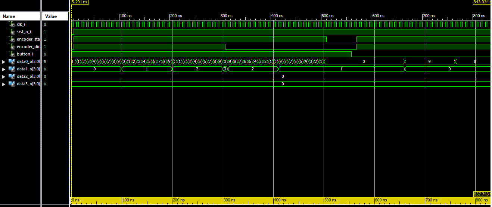
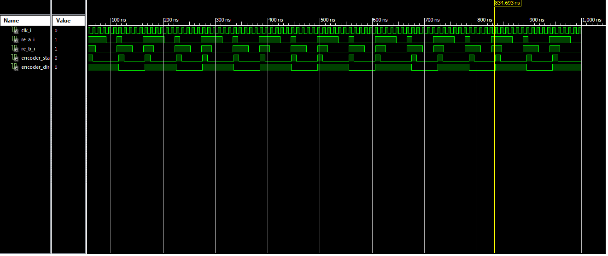
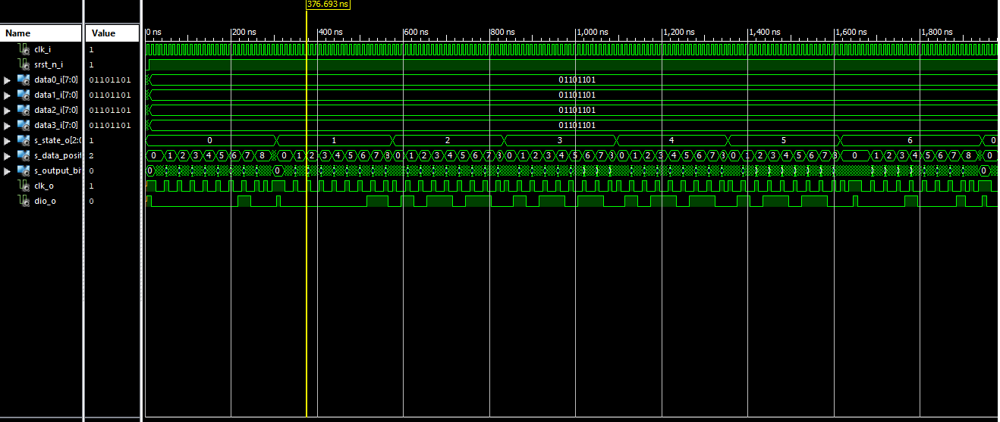

# Projekt Countdown

## Komponenty
[Countdown_top](https://github.com/xpokor79/Digital-electronics-1/blob/master/Labs/Projekt%20-%20Countdown/countdown/countdown_top.vhd)

[Countdown (modul)](https://github.com/xpokor79/Digital-electronics-1/blob/master/Labs/Projekt%20-%20Countdown/countdown/countdown.vhd)

[Encoder driver)](https://github.com/xpokor79/Digital-electronics-1/blob/master/Labs/Projekt%20-%20Countdown/countdown/encoder_driver.vhd)

[Display driver)](https://github.com/xpokor79/Digital-electronics-1/blob/master/Labs/Projekt%20-%20Countdown/countdown/display_driver.vhd)

## Simlace + zapojení
### Zapojení countdown

### Zapojení encoderu

### Simulace countdown top

### Simulace countdown (modul)

### Simulace encoder driver

### Simulace display driver

## Zdroje
[MT1637 datasheet](https://www.mcielectronics.cl/website_MCI/static/documents/Datasheet_TM1637.pdf)

[Encoder driver](https://docplayer.net/21051674-Rotary-encoder-interface-for-spartan-3e-starter-kit.html)
